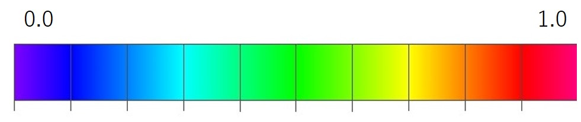

# hand-regard-simulator
Infants about two months old watch the movement of their hands, which is called hand regard. It is considered that after experiencing hand regard, infants may recognize their own hands. This hand-regard-simulator creates a simple model of hand regard and simulates the process by which infants recognize their hands.

To deal with time-varying input and output resulting from movements of infant’s hands, a real-time recurrent learning (RTRL) algorithm is adopted and [RTRL software](http://www.bioinf.jku.at/software/rtrl/) is used.

The simulation results show that information about recognition of the modeled hands of the infant is stored in cell assemblies, which were self-organized. Cell assemblies appear during the phase of U-shaped developments of hand regard, and the configuration of the cell assemblies changes with each U-shaped development. Furthermore, movements like general movements appear during the phase of U-shaped developments of hand regard. 


 

<br>

This video shows output activities of the hidden and output units. Squares of the top line, those of lines 2-4, and those of lines 5-7 of each panel are output activities of the eight output units, and 48 hidden units, respectively. Since the output activities of the hidden and output units are calculated by the logistic function, these output activities take values from 0 to 1. The color scale displays the range of these output activities. The colors of squares show output activities of the output units and hidden units; that is, the red or blue square shows the output activity of output or hidden unit takes a value of 1.0 or 0.0, respectively. Initial weights of the neural network were random in the range [-0.1, 0.1], and the output activities of the hidden units were almost 0.5, which were green squares. However, the hidden units were gradually interconnected with inhibitory weights. Most weights between the hidden units became inhibitory; therefore, output activities of the hidden units were close to zero. Then, hidden units that excite each other appeared as shown by the red squares. This result is consistent with the definition of a cell assembly (i.e., a group of neurons that are strongly coupled by excitatory synapses) (Hebb, 1949). 

<br>

# Installation
This program depends on GNU Compiler Collection (GCC) and parallelized by OpenMP. It took about 48hours to calculate the training on a PC with an old CPU (Intel Xeon E5-2650).
You can compile the source code (src/rtrl.c) and create an executable program rtrl;

```
$ gcc -o rtrl rtrl.c -O2 -lm -fopenmp -mcmodel=large
```

## Running

To train the network:
1. Copy input data file (data/train/rtrlpars.txt) for training to an appropriate directory. 
2. Change to that directory.
3. Run the above program rtrl in that directory;

```
$ ./rtrl
```

# Documentation
See the [documentation](./documentation.md) for how to run tests and display and analyze output results.

# Reference
[1] T. Homma: Hand Recognition Obtained by Simulation of Hand Regard. Front. Psychol. 9:729. doi: 10.3389/fpsyg.2018.00729 | https://doi.org/10.3389/fpsyg.2018.00729

[2] T. Homma: A modeling study of generation mechanism of cell assembly to store information about hand recognition. Heliyon, Volume 6, Issue 11, November 2020, e05347 DOI: https://doi.org/10.1016/j.heliyon.2020.e05347| https://www.cell.com/heliyon/fulltext/S2405-8440(20)32190-3

[3] Hebb, D.O. (1949). The organization of behavior: A neuropsychological theory. New York: Wiley & Sons.

# License
hand-regard-simulator was created by modifying [Real Time Recurrent Learning Software](http://www.bioinf.jku.at/software/rtrl/) developed by Prof. Sepp Hochreiter and distributed under GPL v2. Therefore, hand-regard-simulator is also licensed under GPLv2. See LICENSE.txt for more details.


