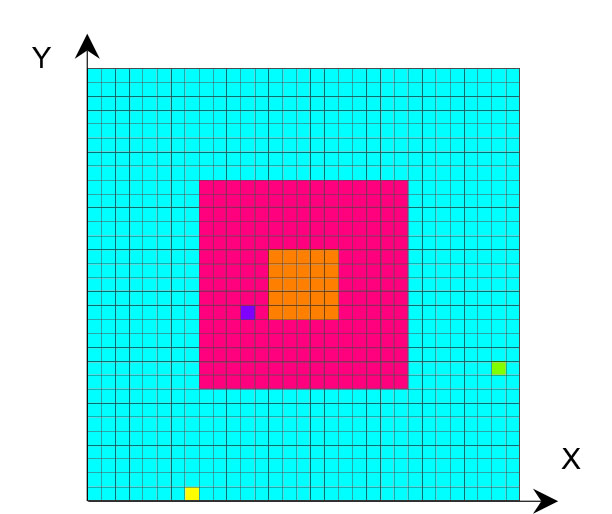
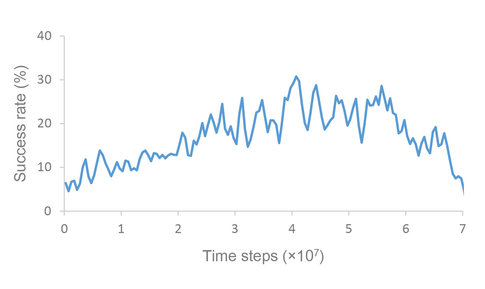
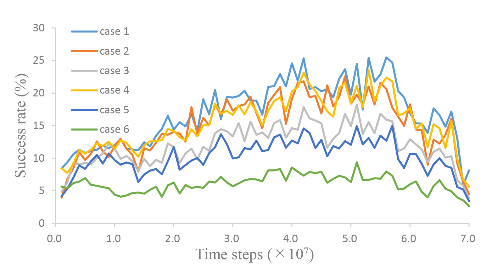
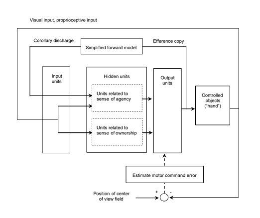
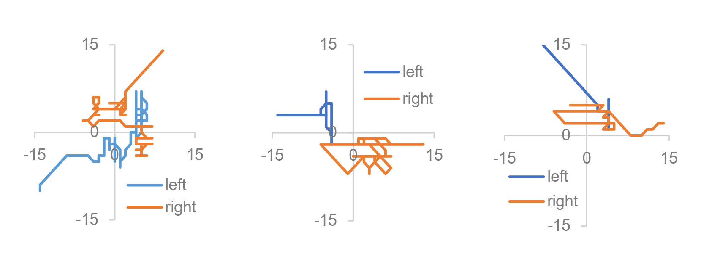
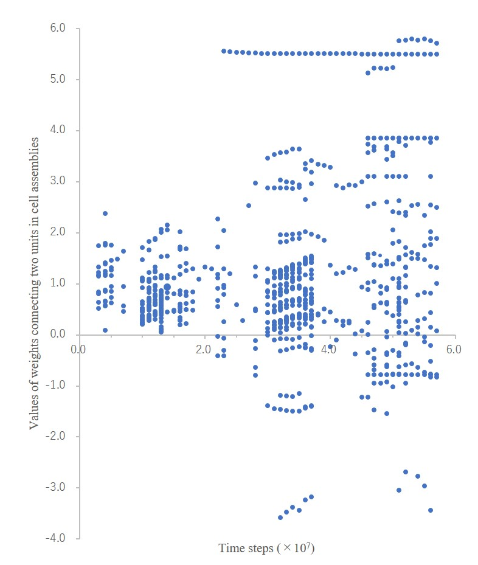
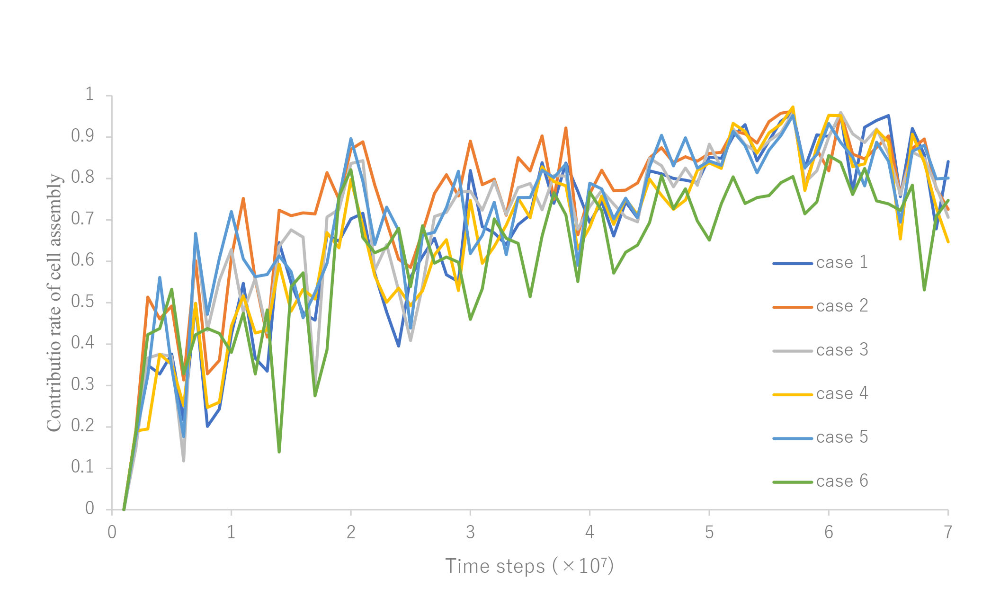

# The hand-regard-simulator documentation

## Content

[Input file](#input-file)
- [Input data file (data/train/rtrlpars.txt)](#input-data-file)

[Output file](#output-file)
- [AVS UCD (Unstructured Cell Data) file (.inp)](#avs-ucd)
- [Weights file (init_weight and wei*.par)](#weights-file)
- [Files for calculating the trajectory of both hands (trajLF0tr.csv, trajRT0tr.csv)](#files-for-calculating-the-trajectory)
- [Files for counting success rate (findLL0tr, findLL0)](#files-for-counting-success-rate)

[Success rate of hand regard](#success-rate-of-hand-regard)
- [Success rate of hand regard in the training phase](#success-rate-of-hand-regard-in-the-training-phase)
- [Success rate of hand regard in the test phase](#success-rate-of-hand-regard-in-the-test-phase)

[Trajectories of both hands](#trajectories-of-both-hands)

[Estimation of the information stored in the cell assemblies](#estimation-of-the-information)
- [Ablating the cell assemblies](#ablating-the-cell-assemblies)
- [Calculating the contribution ratio of the cell assembly](#calculating-the-contribution-ratio)

## <a id="input-file">Input file</a>

In advance of using Real Time Recurrent Learning (RTRL) Software developed by Prof. Sepp Hochreiter (http://www.bioinf.jku.at/software/rtrl/), it is necessary to prepare a set of input data and teaching signals for the training phase and input data for the test phase at every time step; however, that necessity cannot be satisfied because the positions of the hands and other objects dynamically change in hand-regard-simulator. The RTRL software was therefore modified in the following way. Hand regard was learned by the procedural learning to bring both hands to the center of the field of view. The differences between the positions of both hands and the center position of the field of view were computed by using the proprioceptively perceived position. These differences were then converted to motor-command errors (i.e., differences between teaching signals and outputs) on the output units every time step on the basis of the method proposed by Kawato et al. (Kawato et al., 1987) (see [Reference [1]](#reference1)). The weights in the network were updated every ten time steps during the training phase by RTRL. Accordingly, hand-regard-simulator does not use a file containing the set of input data and teaching signals.

## <a id="input-data-file">Input data file (data/train/rtrlpars.txt)</a>

Since RTRL software has been modified specially for the learning of hand regard, general purpose calculations are no longer possible. Change only the parameters in blue in the following input data file for RTRL software (rtrlpars.txt). Most of the other parameters are not used, so enter a dummy value. 

----

rtrlpars.txt  

<span style="color: Blue;">number inputs: 225 </span>             &larr; number of input units  
<font color="Blue">number outputs: 8 </font>              &larr; number of output units  
<font color="Blue">number hidden units: 48 </font>        &larr; number of hidden units  
<font color="Blue">biased: 1 </font>                      &larr; enter “one”  
<font color="Blue">learning rate: 0.40 </font>            &larr; enter learning rate  
max. error for correct sequence: 0.1              
half interval length for intialization: 0.1          
performing test after ? epochs: 1                 
performing test after fewer than ? wrong classifications on training set: 1  
write weight after ? epochs: 1                  
max. number of trials: 1                       
stop learning once MSE per epoch <: 0.001     
stop learning once wrong classifications per epoch <: 1    
epochs to be learned after stop learning is set: 1       
<font color="Blue">initialization of random generator: 8 </font>    &larr; any integer
reset the net after each sequence?: 1              
weight update after sequence or epoch?: 1           
max. number of epochs: 1               
size of training set: 1                      
size of test set: 1                   
<font color="Blue">restart?(yes=1 no=0): 0 </font>      &larr; Enter 1 if you want to restart training or run test with weight file, otherwise enter 0  
<font color="Blue">test or training?(test=1 training=0): 0 </font>    &larr; Enter 1 if you want to run the test, enter 0 if you want to run the training.  
<font color="Blue">max. number of sweeps: 1200000000 </font>   &larr; max number of time steps  

---  
    
The parameter “initialization of random generator” is random seed. By changing this number, you can obtain the network weights initialized to another values.  
If you change the number of input units, output units or hidden units in rtrlpars.txt, you also need to change the max_units, vision_bias, max_outputs defined at the top of rtrl.c and recompile rtrl.c. The parameters defined in rtrl.c, including these parameters, are as follows.
  
|parameters      | description        |
|:------------------------|:------------------------|
| max_units  | number inputs in rtrlpars.txt<br> +1 (bias)<br>+number of corollary discharge (which is equal to number outputs in rtrlpars.txt)<br>+4 (proprioceptive estimates of hands position(x,y))<br>+number hidden units in rtrlpars.txt<br>+number outputs in rtrlpars.txt| 
|vision_bias| number inputs in rtrlpars.txt + 1 (bias) |
|max_outputs| number outputs in rtrlpars.txt|
|MAX_AREA| length of side of field, where hand and others move.<br>Number of squares on one side of a regular quadrangle displayed<br>when eye * .inp is visualized with NAK-Post (see below).|
|NUM_OF_OBJ_TRAIN |nummber of others in training + 1.<br>E.g., if the number of others is 5 in training, enter 6. |
|NUM_OF_OBJ_TEST |number of others in test + 1.<br>E.g., if the number of others is 10 in test, enter 11. |
|UNIT_RANGE | Number of squares in width when ra*.inp is displayed<br>in NAK-Post (see below) |
|INTERVAL_OF_SWEEPS_TRAIN |reset the position of hand and others in training <br>every INTERVAL_OF_SWEEPS_TRAIN time steps. |
|INTERVAL_OF_SWEEPS_TEST| reset the position of hand and others in test <br>every INTERVAL_OF_SWEEPS_TEST time steps. |
|INTERVAL_OF_AVS |output AVS UCD file (see below) every <br> INTERVAL_OF_AVS time steps. |
|AVS_RANGE 100 | output AVS UCD file (see below) <br>for AVS_RANGE time steps every INTERVAL_OF_AVS time steps. | 
|interval_of_backward_pass |train every interval_of_backward_pass time steps |                 
|INTERVAL_OF_RESTART |output weights file (wei*.par) (see below) <br>every INTERVAL_OF_RESTART time steps |  
   
<br />
These parameters are defined at the top of rtrl.c below (shown in blue).
  
---
rtrl.c

#include <math.h>  
#include <stdio.h>  
#include <stdlib.h>  
#include <time.h>  

<font color="Blue">#define max_units 294</font>    
/* number inputs(in "rtrlpars.txt")+bias("1")
  +number of corollary discharge(=number outputs(in "rtrlpars.txt"))
  +4(proprioceptive estimates of hands position(x,y))
  +number hidden units(in "rtrlpars.txt")+number outputs (in "rtrlpars.txt") */  

<font color="Blue">#define vision_bias 226</font>     / * number inputs (in "rtrlpars.txt")+bias(1)  */  

<font color="Blue">#define max_outputs 8</font>      /* number outputs (in "rtrlpars.txt") */  

#define max_sequence_length 1  
#define max_training_size 1  
#define max_test_size 1  
  
/* modified in 02/06/2010 */  
  
<font color="Blue">#define MAX_AREA 31</font>             /* length of side of field, where hand and others move */  

<font color="Blue">#define NUM_OF_OBJ_TRAIN 2</font>      /* number of others in training */   

<font color="Blue">#define NUM_OF_OBJ_TEST 2</font>       /* number of others in test */     

<font color="Blue">#define UNIT_RANGE 8</font>            /* width of expression for RA[] in AVS */  

<font color="Blue">#define INTERVAL_OF_SWEEPS_TRAIN 1000</font> /* interval of resetting the position of hand and others in training*/  

<font color="Blue">#define INTERVAL_OF_SWEEPS_TEST 1000</font> /* interval of resetting the position of hand and others in test*/  

<font color="Blue">#define INTERVAL_OF_AVS 1000000</font>  /* interval of outputting AVS data */  

<font color="Blue">#define AVS_RANGE 100</font>           /* output AVS data for (AVS_RANGE)sweeps every (INTERVAL_OF_AVS)sweeps */   

#define INVARIANT_STEPS 70      /* when RA[] of certain unit does not change, output 1.0 for the unit in AVS data. Currently, it is not used */   

<font color="Blue">#define interval_of_backward_pass 10</font> /* interval of training */                   

<font color="Blue">#define INTERVAL_OF_RESTART 1000000</font> /* interval of outputting restart file (wei*.par) */  

---
  
<br />

## <a id="output-file">Output file</a>

## <a id="avs-ucd">AVS UCD (Unstructured Cell Data) file (.inp)</a>

NAK-Post, a program that visualizes numerical data such as simulation results, experiments, and measurements, is used to visualize hand movements and output activities. NAK-Post is the program for visualize AVS UCD file which has a .inp suffix. It will be published on GitHub Pages in the near future.  
Output files are created to visualize hand movements (eye*.inp) and output activities (ra*inp) as follows.
  
|                | training        | test            |
|------------------------|------------------------|------------------------|
| hand movement | eyeatr.inp      | eye.inp         |
| output activities | raatr.inp       | ra.inp          |
  
<br />  
  
If NAK-Post can be installed, for example, the following command displays output activities in the training phase:
```
$ ./nakp raatr.inp
```

## <a id="weights-file">Weights file (init_weight and wei*.par)</a>

Every INTERVAL_OF_RESTART time steps (see above), the results of training are saved in weights files (wei0.par, wei1.par, wei2.par, …). In the above example, INTERVAL_OF_RESTART is 1.0×10<sup>6</sup>. Accordingly, wei0.par is output at 1.0×10<sup>6</sup> time steps and wei1.par is output at 2.0×10<sup>6</sup> time steps, and so on. These files contain weights, update of weights, new activation for all units, and dyk / dwij derivatives of units with respect to weights. These files are used when restarting training or running tests. The initialized weights at the start of training is saved in weights file (init_weight).

## <a id="files-for-calculating-the-trajectory">Files for calculating the trajectory of both hands (trajLF0tr.csv, trajRT0tr.csv)</a>

These files are to calculate the trajectory of both hands. For simplicity, it is considered that the left hand and right hand of the infant and other object are denoted by one square in a two-dimensional space, and the structure of the upper limbs was omitted from the model; that is, coordinate transformations (which translate sensory inputs to motor outputs) were omitted, and a simulation calculation was executed in a two-dimensional extrinsic coordinate frame.  
The left hand and right hand of the infant and the other object, which are represented by the yellow, yellow-green, and blue squares, respectively, can move to the blue, red, and orange areas in [Figure 1](#figure1). The width corresponds to the length of the infant’s outstretched arms. The red and orange areas are the infant’s field of view, and the orange one is the center of the field of view.  
The coordinate values of the left and right hands in the 2D external coordinate frame in [Figure 1](#figure1) are output to the files trajLF0tr.csv and trajRT0tr.csv, respectively. 

## <a id="files-for-counting-success-rate">Files for counting success rate (findLL0tr, findLL0)</a>

These files are to calculate the frequency that the right or left hand enters the center of visual field, which is defined as success rate of hand regard. The findLL0tr is output during training, and the findLL0 is output during test. At each time step, if the right or left hand is in the center of visual field (the orange, five-by-five square in [Figure 1](#figure1)), 1 is output to these files, otherwise 0 is output to these files.   
When you execute program rtrl, you can also find the files (find0tr, find0) and (findL0tr, find0tr) which record the frequency that both hands enter the area of three-by-three square and seven-by-seven square at the center of visual field, respectively. In [Reference [1]](#reference1), however, findLL0tr and findLL0 were used to calculate that frequency.


## <a id="figure1"></a>




**Figure 1** Simulation model for learning hand regard.

<br>

## <a id="success-rate-of-hand-regard">Success rate of hand regard (see [Reference [1]](#reference1))</a>

## <a id="success-rate-of-hand-regard-in-the-training-phase">Success rate of hand regard in the training phase</a>

To calculate success rate of hand regard in the training phase:
1. Copy countLL0_m.c (src/countLL0_m.c) to the directory where findLL0tr exists.
2. Compile countLL0_m.c and create an executable program countLL0_m;  

```
$ gcc -o countLL0_m countLL0_m.c
```

3. Run the above program countLL0_m in that directory;
  
```
$ ./countLL0_m
```
  
4. You can find countoutLL0.csv which contains the time series of success rate in csv format.  

<br>

---
countoutLL0.csv

time steps &emsp;   success rate  
&nbsp; 250000 &emsp; &emsp;&emsp;&nbsp;&nbsp;    0.7   
&nbsp; 750000 &emsp; &emsp;&emsp;&nbsp;&nbsp;    0.0  
1250000       &emsp; &emsp;&emsp; 10.0  
1750000       &emsp; &emsp;&emsp; 20.0    
&emsp;&emsp; : &emsp;&emsp; &emsp;&emsp;&emsp;       :  

---

<br>

In [Reference [1]](#reference1), a neural network was trained ten times with weights initialized randomly by changing the parameter “initialization of random generator” in [rtrlpars.txt](#input-data-file) above. Since countoutLL0.csv is output in csv format, the ensemble average of the success rates obtained by the ten-times training can be easily calculated by Excel. The ensemble average of the success rates obtained by the ten-times training is plotted in [Figure 2](#figure2). 


## <a id="figure2"></a>




**Figure 2** Success rate of hand regard in the training phase.

<br>

## <a id="success-rate-of-hand-regard-in-the-test-phase">Success rate of hand regard in the test phase</a>

The test, which consists of cases varying the visual input value of other object and the number of other objects, was conducted in [Reference [1]](#reference1). Success rate was calculated by changed visual input condition. The network weights were saved every 1.0×10<sup>6</sup> time steps during the training phase. Success rate in the test phase was estimated on the basis of the saved network weights. The collection of success rates, which were calculated using the network weights that were saved every 1.0×10<sup>6</sup> time steps, resulted in a time series of success rates.  
In the training phase, visual input value of hands, visual input value of other object, and number of other objects were 0.5, 0.2, and 1, respectively. In the test phase, visual input value of other object was 0.2 or 0.5 and number of other objects was 1, 5, or 20; that is, the test consists of 6 cases by combining 2 cases (visual input value of other object) and 3 cases (number of other objects).
If you want to change the number of other objects, change the number in blue in #definition statement below in rtrl.c:

<br>

---
rtrl.c

#define NUM_OF_OBJ_TEST <font color="Blue">2</font>       /* number of others in test */   

---
<br>

Note that NUM_OF_OBJ_TEST is sum of number of others in test and 1. In the above example, the number of other objects is 1.  
If you want to change the visual input value of other object in the test phase, change the number 0.5 in the following two assignment statements INPUTS[number_of_inputs] = <font color="Blue">0.5</font> in rtrl.c:

<br>

~~~
rtrl.c  

/* input data into INPUTS array */  
for(nn=NUM_OF_OBJ; nn>=0; nn--)  
	{  
                    :  
                    :  
		  {  
		    if(nn == 0 || nn == 1)  
		      {  
		        INPUTS[number_of_inputs] = 0.5;  
		      }  
		    else  
		      {  
		       if(test_flag)  
			        {  
			          INPUTS[number_of_inputs] = 0.5;   
                        *the visual input value of other object in the test phase*
                        *change the value of 0.5 in this assignment statement*
		 	        }  
		       else  
			        {  
			          INPUTS[number_of_inputs] = nn*0.1;  
		  	      }  
		      }  
		  }  
    else   
        /*Change INPUTS[] values when different input values are used 
        for the center and periphery of the field of view. Currently, 
        the same values are input.  */  
	  	{  
		    if(nn == 0 || nn == 1)  
	  	    {  
		        INPUTS[number_of_inputs] = 0.5;  
		      }  
		    else  
		      {  
		        if(test_flag)  
			          {  
			            INPUTS[number_of_inputs] = 0.5;  
                           *the visual input value of other object in the test phase*
                           *change the value of 0.5 in this assignment statement*  
		          	}  
		        else  
		          	{  
			            INPUTS[number_of_inputs] = nn*0.1;  
		          	}  
		      }  
	  	}  
	  }  
	}  

~~~


<br>

You can compile the source code (src/rtrl.c) and create an executable program rtrl;
```
$ gcc -o rtrl rtrl.c -O2 -lm -fopenmp -mcmodel=large
```

After changing the number of other objects or the input values of other objects, you need to compile rtrl.c. The compilation to create the executable program rtrl to run the test is as follows.
```
$ gcc -o rtrl rtrl.c -O2 -lm -mcmodel=large
```


The calculation of weight updates in the training is parallelized by OpenMP. On the other hand, the weights are not updated in the test, so compile rtrl.c without the OpenMP options.   
One way to run a lot of tests by changing the number of other objects or the input values of other objects is shown below. There may be a more efficient way.  
You run the tests in multiple cases where you change the number of other objects or the input values of other objects, and calculate success rate of hand regard for each case in the test phase. 
1. Create a directory for each case as shown below.
```
/home/src/case1/
/home/src/case2/
      :
```
2. In each directory, modify the source code rtrl.c according to the conditions of each case and compile it.
3. Copy input data file (data/test/rtrlpars.txt) for test to the directory where weights files exist.
4. Copy counttestLL.c (src/counttestLL.c) to the directory where weights files exist.
5. Compile counttestLL.c and create an executable program counttestLL;
```
$ gcc -o counttestLL counttestLL.c 
```
6. Copy a shell script exeall (src/exeall) to the directory where weights files exist.

```exeall

#! /bin/bash

ls -t -r wei* > filelist

for fname in $(< filelist)
do
    cp $fname restart_file
    /home/src/case1/rtrl
    ./counttestLL
    cat out_counttestLL >> resultLL-case1
done

for fname in $(< filelist)
do
    cp $fname restart_file
    /home/src/case2/rtrl
    ./counttestLL
    cat out_counttestLL >> resultLL-case2
done

for fname in $(< filelist)
do
    cp $fname restart_file
    /home/src/case3/rtrl
    ./counttestLL
    cat out_counttestLL >> resultLL-case3
done
            :
            :
```
7. Add the processing to exeall for the required number of cases.
8. Grant execute permission to exeall.
```
$ chmod 755 exeall
```
9. Run exeall:
```
$ ./exeall
```
10. Copy changecsv.c (src/changecsv.c) to the directory where weights files exist.
11. Compile changecsv.c and create an executable program changecsv;
```
$ gcc -o changecsv changecsv.c
```
12. Calculate the time series of success rate of case 1 as follows:
```
$ cp resultLL-case1 timehistory 
$ ./changecsv
```
13. You can find out-timehistory.csv which contains the time series of success rate of case 1 in csv format.

<br>

---
out-timehistory.csv

time steps &emsp; success rate  
1000000 &emsp; &emsp;&emsp;&nbsp;&nbsp;  3.0   
2000000 &emsp; &emsp;&emsp; 14.9  
3000000 &emsp; &emsp;&emsp;&nbsp;&nbsp;  9.8  
4000000 &emsp; &emsp;&emsp;  10.7   
&nbsp;&emsp; :  &nbsp;&nbsp;&emsp;&emsp;&emsp;&emsp;&emsp;&nbsp;  :    

---

<br>

14. Rename the file, for example, from out-timehistory.csv to out-timehistory-case1.csv
```
$ mv out-timehistory.csv out-timehistory-case1.csv
```
15. The time series of success rates in other cases can also be calculated in the same way.

In [Reference [1]](#reference1), a neural network was trained ten times with weights initialized randomly by changing the parameter “initialization of random generator” in  [rtrlpars.txt](#input-data-file) above. A time series of success rates during the test phase was obtained ten times, by testing the network with the network weights that were saved every 1.0×10<sup>6</sup> time steps in response to the ten initializing weights. The ensemble averages of the success rates obtained by the ten testing trials for each case in [Reference [1]](#reference1) are plotted in [Figure 3](#figure3). Since out-timehistory.csv is output in csv format, the ensemble averages of the 10 success rates can be easily calculated by Excel.
In exeall, weights files are copied to the restart file in the order of wei0.par, wei1.par… and tests are conducted. The date and time the weight files were created is used to run exeall. Therefore, if you want to copy the weights files to another directory and calculate the time series of success rates, copy them with -a option like below:
```
$ cp –a wei* another directory/.
```
<br>


## <a id="figure3"></a>




**Figure 3** Success rate of hand regard in the test phase. Visual input value of other object and number of other objects were 0.2 and 1 (case 1), 0.2 and 5 (case 2), 0.2 and 20 (case 3), 0.5 and 1 (case 4), 0.5 and 5 (case 5), and 0.5 and 20 (case 6).


## <a id="trajectories-of-both-hands">Trajectories of both hands</a>

The initial weights of the neural network were randomized in the range [-0.1, 0.1]. However, the hidden units were gradually interconnected with inhibitory weights during training phase and most weights between the hidden units became inhibitory. Then, the hidden units that excited each other appeared, which is consistent with the definition of a cell assembly (i.e., a group of neurons that are strongly coupled by excitatory synapses) (Hebb, 1949). The output activities of the hidden units fluctuated significantly, with some inhibitory weights being transformed into excitatory ones.
In the present model, the fluctuations of the hidden units are projected onto the output units ([Figure 4](#figure4)). The fluctuations therefore affected movements of both hands; that is, the movements resembled general movements (GMs), which involve circular movements, moderate speed, and variable acceleration of the neck, trunk and limbs in all directions (Einspieler et al., 2007). In fact, trajectories of both hands indicate that movements of both hands were circular and zig-zag form, which are typical of GMs (Hopkins and Prechtl, 1984) ([Figure 5](#figure5)). Note that circles became polygons because the hands have moved one square up and down and one square left and right. 


## <a id="figure4"></a>




**Figure 4** Block diagram of learning hand regard.

<br>


## <a id="figure5"></a>




**Figure 5** Trajectories of both hands.

<br>

The trajectory of both hands can be output as follows.
1. Copy select_traj.c (src/select_traj.c) to the directory where trajRT0tr.csv and trajLF0tr.csv exist.
2. Specify the start time step (the value of the start variable in blue) and the end time step (the value of the end variable in blue) of the trajectory of both hands you want to display in select_traj.c.

<br>

---
select_traj.c

/* how to compile : gcc -o select_traj select_traj.c */  
#include <stdio.h>  
#include <stdlib.h>  

int main(void)  
{  
  long int start=<font color="Blue">84900001; </font>  
  long int end  =<font color="Blue">84900500; </font>  
&nbsp; &emsp;  &emsp; &emsp; :  
&nbsp; &emsp;  &emsp; &emsp; :
  
---
  
<br>

3. Compile select_traj.c and create an executable program select_traj;
```
$ gcc -o select_traj select_traj.c
```
4. Run the program select_traj in that directory;
```
$ ./ select_traj
```
5. You can find select_trajRT0tr.csv and select_trajLF0tr.csv that contain the trajectory of the right hand and the trajectory of the left hand with the center of the field of view as the origin of the two-dimensional coordinates in csv format.

<br>

---
select_trajRT0tr.csv

|X coordinate |Y coordinate |
|------------------------:|------------------------:|
| 11 | -8 |
| 11 | -8|
| 10 | -7
| 9 | -6 | 
|   :  |  :  |
---

<br>

## <a id="estimation-of-the-information">Estimation of the information stored in the cell assemblies</a>

Humans and animals learn daily and memorize new information acquired by learning. Changes in the brain that correspond to memory are called memory engrams, and the particular population of neurons that hold a memory engram is the cell assembly. 
Many studies have attempted to prove the cell assembly hypothesis using several different approaches (Tonegawa, Liu, Ramirez, & Redondo, 2015). The ablation (Han, et al., 2009) or inhibition (Zhou, et al., 2009) of a subset of active neurons during training was shown to disrupt fear memories in mice. Moreover, mice could recall fear memories following the optogenetic reactivation of neurons that were activated during fear learning (Liu, et al., 2012). 
Therefore, to estimate the information stored in the cell assembly, there is the method of reactivating the cell assembly in addition to the method of ablation or inhibition of the cell assembly. The simulation model for learning hand regard shown in [Figure 4](#figure4) represented the relationship between the inputs (the corollary discharges, visual inputs, and proprioceptive inputs) and outputs. Regardless of inputs, only reactivating the units belonging to the cell assembly does not realize hand-regard behavior. This is exactly the difference between fear learning and procedural learning like learning of hand regard. In the present model, the method of ablating the cell assembly was adopted to estimate the information stored in the cell assembly (see [Reference [2]](#reference2)).
  
## <a id="ablating-the-cell-assemblies">Ablating the cell assemblies</a>
A group of hidden units with an output value of 0.9 or greater was defined as a cell assembly. These hidden units were strongly coupled by excitatory weights, which satisfied the definition of a cell assembly that was proposed by Hebb (Hebb, 1949). 
To evaluate the contribution of the information stored in the cell assemblies, the units belonging to the cell assemblies were ablated from the hidden units, as follows. Among the weights stored every 1.0×10<sup>6</sup> time steps, the weights for the hidden units with outputs of 0.9 or greater were set to zero. For the weights from any hidden unit in the cell assemblies to any input or hidden unit,

``` 
wij= 0, i∈I∪H, j∈the set of all hidden units in cell assemblies, 
```
and for the weights from any hidden or output unit to any hidden unit in the cell assemblies,

``` 
wij= 0, i∈the set of all hidden units in cell assemblies,   j∈H∪O. 
```
Here, I represents an index set of input units, H represents an index set of hidden units, and O represents an index set of output units. 
Specifically, the ablation is executed by the following procedure.
1. Copy raatr.inp with the name ra_short.

```
$ cp raatr.inp ra_short
```
2. Open ra_short with an editor, delete the blue part of ra_short and save it.

<br>

--- 
ra_short

&emsp;<font color="Blue">120000</font>  
<font color="Blue">data</font>  
step1&emsp;&emsp;&emsp;&emsp;&emsp;&nbsp;1  
&emsp;&emsp;<font color="Blue">72&emsp;      56  
&emsp;&nbsp; 1&emsp;&nbsp; 0.0&emsp;&nbsp; 0.0&emsp;&nbsp; 0.0  
&emsp;&nbsp; 2&emsp;&nbsp; 1.0&emsp;&nbsp; 0.0&emsp;&nbsp; 0.0  
&emsp;&nbsp; 3&emsp;&nbsp; 2.0&emsp;&nbsp; 0.0&emsp;&nbsp; 0.0  
&emsp;&nbsp; 4&emsp;&nbsp; 3.0&emsp;&nbsp; 0.0&emsp;&nbsp; 0.0  
&emsp;&nbsp; 5&emsp;&nbsp; 4.0&emsp;&nbsp; 0.0&emsp;&nbsp; 0.0  
&emsp;&nbsp; 6&emsp;&nbsp; 5.0&emsp;&nbsp; 0.0&emsp;&nbsp; 0.0  
　　　　　：  
　　　　　：  
&emsp;&nbsp;72&emsp;&nbsp; 8.0&emsp;&nbsp; 7.0&emsp; 0.0  
&emsp;&emsp; 1 1&nbsp; quad&emsp;&emsp; 1&emsp;&emsp; 2&emsp;&emsp; 11&emsp;&emsp; 10  
&emsp;&emsp; 2 1&nbsp; quad&emsp;&emsp; 2&emsp;&emsp; 3&emsp;&emsp; 12&emsp;&emsp; 11  
&emsp;&emsp; 3 1&nbsp; quad&emsp;&emsp; 3&emsp;&emsp; 4&emsp;&emsp; 13&emsp;&emsp; 12  
&emsp;&emsp; 4 1&nbsp; quad&emsp;&emsp; 4&emsp;&emsp; 5&emsp;&emsp; 14&emsp;&emsp; 13  
&emsp;&emsp; 5 1&nbsp; quad&emsp;&emsp; 5&emsp;&emsp; 6&emsp;&emsp; 15&emsp;&emsp; 14  
&emsp;&emsp; 6 1&nbsp; quad&emsp;&emsp; 6&emsp;&emsp; 7&emsp;&emsp; 16&emsp;&emsp; 15  
　　　　　　　：  
　　　　　　　：  
&emsp;&emsp;56 1&nbsp; quad&emsp;&emsp;62&emsp;&emsp;63&emsp;&emsp;72&emsp;&emsp;71</font>  
0 1  
1 1  
RA[],   
&emsp;&emsp; 1&emsp;&emsp;&emsp; 0.5  
&emsp;&emsp; 2&emsp;&emsp;&emsp; 0.5  
&emsp;&emsp;&emsp;&emsp;：  
&emsp;&emsp;&emsp;&emsp;：  
&emsp;&emsp;56&emsp;&emsp;&emsp;0.6  
step2&emsp;&emsp;&emsp;&emsp;&emsp;&emsp;&emsp;&emsp;&emsp;2  
0 1  
1 1  
RA[],   
&emsp;&emsp; 1&emsp;&emsp;&emsp; 0.5  
&emsp;&emsp; 2&emsp;&emsp;&emsp; 0.5  
&emsp;&emsp;&emsp;&emsp;：  
&emsp;&emsp;&emsp;&emsp;：  
&emsp;&emsp;56&emsp;&emsp;&emsp; 0.6  
step3&emsp;&emsp;&emsp;&emsp;&emsp;&emsp;&emsp;&emsp;&emsp;3  
0 1  
1 1  
RA[],   
&emsp;&emsp; 1&emsp;&emsp;&emsp; 0.5  
&emsp;&emsp; 2&emsp;&emsp;&emsp; 0.5  
&emsp;&emsp;&emsp;&emsp;：  
&emsp;&emsp;&emsp;&emsp;：    
&emsp;&emsp;56&emsp;&emsp;&emsp; 0.5   
step4&emsp;&emsp;&emsp;&emsp;&emsp;&emsp;&emsp;&emsp;&emsp;4  
&emsp;&emsp;&emsp;&emsp;：  
&emsp;&emsp;&emsp;&emsp;：  

---  

<br>

3. You can see that ra_short is a repeat of the same format of data.
``` 
ra_short

step1                        1
0 1
1 1
RA[], 
        1         0.5
        2         0.5
　　　　　　　：
　　　　　　　：
       56         0.6
step2                        2
0 1
1 1
RA[], 
        1         0.5
        2         0.5
　　　　　　　：
　　　　　　　：
       56         0.6
step3                        3
0 1
1 1
RA[], 
        1         0.5
        2         0.5
　　　　　　　：
　　　　　　　：
       56         0.5
step4                        4
　　　　　　　：
　　　　　　　：
```

4. Copy set_zero_cell.c (src/set_zero_cell.c) to the directory where weights files (wei0.par, wei1.par, wei2.par, …) exist.
5. If you change the number of input units, output units or hidden units in rtrlpars.txt and the max_units in rtrl.c as above, you also need to change max_units, in_mod (number of input units), out_mod (number of output units) and hid_mod (number of hidden units) displayed in blue in set_zero_cell.c below;

<br>

---
set_zero_cell.c

#include <stdio.h>  
#include <stdlib.h>  
#include <math.h>  
<font color="Blue">#define max_units 294</font>  
&emsp;&emsp;&emsp;:  
&emsp;&emsp;&emsp;:  
int main(void)  
{  
  <font color="Blue">in_mod = 225;  
  out_mod = 8;  
  hid_mod = 48; </font>  
&emsp;&emsp;&emsp;:  
&emsp;&emsp;&emsp;:

---

<br>

6. Compile set_zero_cell.c and create an executable program set_zero_cell;
```
$ gcc -o set_zero_cell set_zero_cell.c
```
7. Copy a shell script exe_zero_cell (src/exe_zero_cell) to the directory where weights files exist.
8. Grant execute permission to exe_zero_cell.
```
$ chmod 755 exe_zero_cell
```
9. Run exe_zero_cell:
```
$ ./exe_zero_cell
```
10. You can find weights files (cell_wei0.par, cell_wei1.par, cell_wei2.par, …) which contain the weights for the hidden units belonging to the cell assemblies are set to zero.
11. You can also find cell_assembly_weight.csv which contains values of the weights between two units that belong to cell assemblies in csv format.

<br>

---
cell_assembly_weight.csv

|     |icount |(i-th hidden unit, j-th hidden unit) |values of the weights | 
|-----------:|-----------:|-----------:|-----------:|
| icount= |    2| (20,20):| 0.518528|
| icount= |    2| (20,21):| 0.806638|
| icount= |    2| (20,23):| 1.326744|
| icount= |    2| (21,20):| 0.636955|
| icount= |    2| (21,21):| 1.170648|
| icount= |    2| (21,23):| 1.218647|
| icount= |    2| (23,20):| 0.845781|
| icount= |    2| (23,21):| 1.153513|
| icount= |    2| (23,23):| 1.750839|
| icount= |    3| (11,11):| 2.382212|
| icount= |    3| (11,20):| 0.086147|
| icount= |    3| (11,21):| 0.570974|
| icount= |    3| (11,23):| 0.873828|
|         | :    |        |         |
|         | :    |        |         |

---
<br>

The network weights were saved in weights files (wei0.par, wei1.par, wei2.par, …) every 1.0×10<sup>6</sup> time steps during the training phase. Here icount is the number of xxx in weixxx.par. For example, 
```
icount=      2                         (20,20):          0.518528
``` 
means that the value of the weights between the 20th hidden unit and the 20th hidden unit (i.e., self-loop) is 0.518528 saved in wei2.par (i.e., at 3.0×10<sup>6</sup> time steps). [Figure 6](#figure6) is a distribution map in which (icount+1) ×10<sup>6</sup> are on the X-axis and values of the weights are on the Y-axis. This figure shows that values of the weights between the units belonging to the cell assembly increase over time.  

<br>

## <a id="figure6"></a>



<br>


**Figure 6** Values of the weights between two units that belong to cell assemblies.

<br>

In [Reference [1]](#reference1), a neural network was trained ten times with weights initialized randomly by changing the parameter “initialization of random generator” in  [rtrlpars.txt](#input-data-file) above. The ablation was conducted on the network weights that were saved every 1.0×10<sup>6</sup> time steps during the training phase, for each of ten initializing weights in [Reference [1]](#reference1). As a result of this ablation, ten sets of weights were obtained, with the weights of the units belonging to the cell assemblies equal to zero.

The pseudo code of ablating the cell assemblies algorithm can be represented as follows: 

    FOR each of ten initializing weights  
      FOR every 1.0E6 time steps during the training phase  
        FOR each hidden unit  
          IF output activity of hidden unit >= 0.9 THEN  
            weights for hidden unit = 0.0  
          END IF  
        END FOR  
      END FOR  
    END FOR  

In exe_zero_cell, weights files are copied to the restart file in the order of wei0.par, wei1.par… and the ablation is executed. The date and time the weight files were created is used to run exe_zero_cell. Therefore, if you want to copy the weights files to another directory and ablate the cell assemblies, copy them with -a option like below:
```
$ cp –a wei* another directory/.
```

<br>

## <a id="calculating-the-contribution-ratio">Calculating the contribution ratio of the cell assembly</a>

To evaluate the contribution of the information stored in the cell assemblies, then calculate the contribution ratio of the cell assembly as follows. 

First, run the tests in the same cases as in the above [Success rate of hand regard in the test phase](#success-rate-of-hand-regard-in-the-test-phase) by using the weights files (cell_wei0.par, cell_wei1.par, cell_wei2.par, …) obtained above. Therefore, the test is conducted with the executable program rtrl corresponding to each case as in the above [Success rate of hand regard in the test phase](#success-rate-of-hand-regard-in-the-test-phase).

1. Copy input data file (data/test/rtrlpars.txt) for test to the directory where weights files (cell_wei0.par, cell_wei1.par, cell_wei2.par, …) exist.
2. Copy counttestLL.c (src/counttestLL.c) to the directory where weights files　(cell_wei0.par, cell_wei1.par, cell_wei2.par, …) exist.
3. Compile counttestLL.c and create an executable program counttestLL;
```
$ gcc -o counttestLL counttestLL.c 
```
4. Copy the shell script exeall created in [Success rate of hand regard in the test phase](#success-rate-of-hand-regard-in-the-test-phase) to the directory where weights files (cell_wei0.par, cell_wei1.par, cell_wei2.par, …) exist as the file name exeall_cell.
5. Add “cell_” in blue to the following part of exeall_cell.

<br>

---
exeall_cell

#! /bin/bash

ls -t -r <font color="Blue">cell_</font>wei* > filelist  
&emsp;&emsp;&emsp; :  
&emsp;&emsp;&emsp; :

---

<br>

6. Run exeall_cell:
```
$ ./exeall_cell
```
7. Copy changecsv.c (src/changecsv.c) to the directory where weights files (cell_wei0.par, cell_wei1.par, cell_wei2.par, …) exist.
8. Compile changecsv.c and create an executable program changecsv;
```
$ gcc -o changecsv changecsv.c
```
9. Calculate the time series of success rate of case 1 as follows:
```
$ cp resultLL-case1 timehistory 
$ ./changecsv
```
10. You can find out-timehistory.csv which contains the time series of success rate of case 1 in csv format.
11. Rename the file, for example, from out-timehistory.csv to out-timehistory-case1_cell.csv.
```
$ mv out-timehistory.csv out-timehistory-case1_cell.csv
```
12. The time series of success rates in other cases can be calculated in the same way with weights files (cell_wei0.par, cell_wei1.par, cell_wei2.par, …).

The ablation was conducted on the network weights that were saved every 1.0×10<sup>6</sup> time steps during the training phase, for each of ten initializing weights in [Reference [1]](#reference1) as described above. Therefore, steps 1 to 12 were performed for each of the ten sets of weights obtained after ablation.
Subtracting the time series of success rates obtained after ablating the cell assemblies (hereinafter referred to as success rate after ablation) from the time series of success rates obtained before ablating the cell assemblies ([Figure 3](#figure3), hereinafter referred to as success rate before ablation) resulted in a time series of success rates demonstrating the contributions of information stored in the cell assemblies (hereinafter referred to as the success rate contributed to by cell assemblies). 
The contribution ratio of the cell assembly is defined as an index for measuring the degree to which the information stored in the cell assembly contributed to improvements in the success rate, and was calculated as follows. The time series of success rates consists of a collection of success rates calculated by the network weights that were saved every 1.0×10<sup>6</sup> time steps. Let the contribution ratio of the cell assembly equal the success rate contributed by cell assemblies divided by the success rate before ablation:

```
contribution ratio of the cell assembly = success rate contributed by cell assemblies / success rate before ablation.		
```

The contribution ratio of the cell assembly was calculated using the success rates obtained by testing ten sets of weights for each of the six cases shown in [Figure 3](#figure3), taking measurements every 1.0×10<sup>6</sup> time steps. The collection of contribution ratios of the cell assemblies, obtained every 1.0×10<sup>6</sup> time steps, resulted in a time series of the contribution ratio of the cell assembly. Consequently, the ensemble averages of the contribution ratios of the cell assembly were obtained using ten sets of weights for each case. Since the number of time steps at which training ends depends on the initial values of weights, the number of end time steps in the 10 time series of the contribution ratio of the cell assembly is different. When the time series of the contribution ratio of the cell assembly ended, the remaining time series of the contribution ratio of the cell assembly was averaged. [Figure 7](#figure7) shows the ensemble averages for the contribution ratios of the cell assembly, obtained using ten sets of weights for each of the six cases in [Figure 3](#figure3) (see [Reference [2]](#reference2)).


## <a id="figure7"></a>




**Figure 7** Time series of contribution ratios of cell assembly.

The pseudo code of the contribution ratio of the cell assembly algorithm may be summarized as follows:

    1) Before ablation 
      FOR case = 1 to 6
        FOR each of ten sets of weights obtained before ablation
          Conduct test
          FOR every 1.0E6 time steps during the test phase
            Calculate success rate before ablation
          END FOR
        END FOR
      END FOR
    2) after ablation 
      FOR case = 1 to 6
        FOR each of ten sets of weights obtained after ablation
          Conduct test
          FOR every 1.0E6 time steps during the test phase
            Calculate success rate after ablation
          END FOR
        END FOR
      END FOR
    3) Calculate success rate contributed by cell assemblies
      FOR case = 1 to 6
        FOR each of ten sets of weights obtained before and after ablation
          FOR every 1.0E6 time steps during the test phase
            success rate contributed by cell assemblies 
            = success rate before ablation - success rate after ablation
          END FOR
        END FOR
      END FOR
    4) Calculate contribution ratio of the cell assembly
      FOR case = 1 to 6
        FOR each of ten sets of weights obtained before and after ablation
          FOR every 1.0E6 time steps during the test phase
            contribution ratio of the cell assembly 
            = success rate contributed by cell assemblies 
            / success rate before ablation
          END FOR
        END FOR
      END FOR
    5) Ensemble averages of the contribution ratios of the cell assembly
      FOR case = 1 to 6
        Take ensemble averages of the contribution ratios of the cell assembly obtained using ten sets of weights
      END FOR

In exeall_cell, weights files (cell_wei0.par, cell_wei1.par, cell_wei2.par, …) are copied to the restart file in the order of cell_wei0.par, cell_wei1.par, cell_wei2.par, … and tests are conducted. The date and time the weight files were created is used to run exeall_cell. Therefore, if you want to copy the weights files (cell_wei0.par, cell_wei1.par, cell_wei2.par, …) to another directory and calculate the time series of success rates, copy them with -a option like below:
```
$ cp –a cell_wei* another directory/.
```

<br>

Reference

<a id="reference1"></a>
[1] T. Homma: Hand Recognition Obtained by Simulation of Hand Regard. Front. Psychol. 2018; 9: 729. doi: 10.3389/fpsyg.2018.00729 | https://doi.org/10.3389/fpsyg.2018.00729

<a id="reference2"></a>
[2] T. Homma: A modeling study of generation mechanism of cell assembly to store information about hand recognition. Heliyon, Volume 6, Issue 11, November 2020, e05347 DOI: https://doi.org/10.1016/j.heliyon.2020.e05347| https://www.cell.com/heliyon/fulltext/S2405-8440(20)32190-3

[3] Hebb, D.O. (1949). The organization of behavior: A neuropsychological theory. New York: Wiley & Sons.

[4] Einspieler, C., Marschik, P.B., Milioti, S., Nakajima, Y., Bos, A.F., and Prechtl, H.F.R. (2007). Are abnormal fidgety movements an early marker for complex minor neurological dysfunction at puberty? Early Hum Dev 83, 521-525.

[5] Hopkins, B., and Prechtl, H.F.R. (1984). "A Qualitative approach to the development of movements during early infancy," in Continuity of neural function from prenatal to postnatal life, ed. Prechtl, H. F. R.  (Oxford: Blackwell Scientific Publications), 179-197.

[6] Tonegawa, S., Liu, X., Ramirez, S., & Redondo, R. (2015). Memory Engram Cells Have Come of Age. Neuron, 87, 918-931.

[7] Han, J. H., Kushner, S. A., Yiu, A. P., Hsiang, H. L., Buch, T., Waisman, A., Bontempi, B., Neve, R. L., Frankland, P. W., & Josselyn, S. A. (2009). Selective erasure of a fear memory. Science, 323, 1492-1496.

[8] Zhou, Y., Won, J., Karlsson, M. G., Zhou, M., Rogerson, T., Balaji, J., Neve, R., Poirazi, P., & Silva, A. J. (2009). CREB regulates excitability and the allocation of memory to subsets of neurons in the amygdala. Nat Neurosci, 12, 1438-1443.

[9] Liu, X., Ramirez, S., Pang, P. T., Puryear, C. B., Govindarajan, A., Deisseroth, K., & Tonegawa, S. (2012). Optogenetic stimulation of a hippocampal engram activates fear memory recall. Nature, 484, 381-385.
